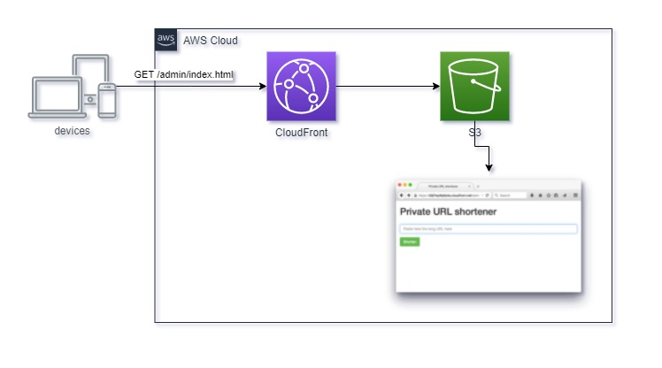
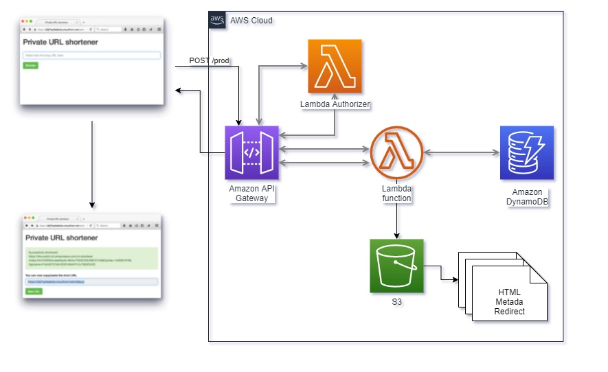
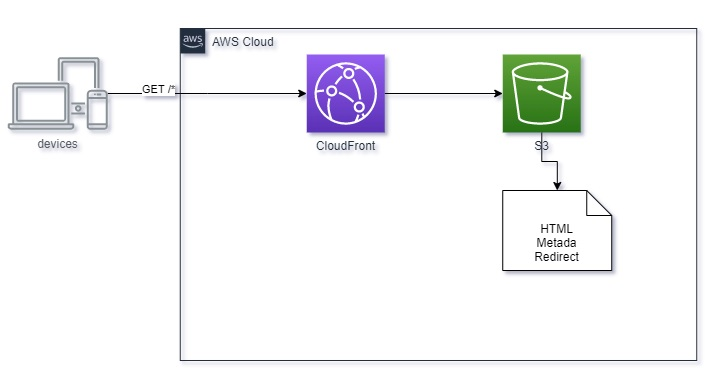

# URL Shortener
Projeto encurtador de urls privado.

# Conteúdo
* [Motivadores](#motivadores)
* [Desenho da Solução](#solucao)
* [Membros do Time](#team-members)

# Motivadores
Como não é muito diferente para a maioria dos profissionais que trabalham remotamente em meio a diversas marcações de reuniões durante o dia, tive necessidade de enviar os convites gerados pelas ferramentas de colaboração como o Microsoft Teams por email ou WhatsApp, quando identifiquei o quanto era inconveniente a cópia e distribuição dos links dado o tamanho dos mesmos. Quando surgiu a necessidade de um encurtador de URLs.

Encotrei diversos projetos opensource de encurtamento de URLs, mas a grande maioria, utilizando uma infraestrutura externa, e sabendo que um agente externo estaria inteceptando as minhas URLs, decidi implementar o encurtador de urls privado. Desta forma consigo ter o controle de todos os redirecionamentos e garantir a segurança dos redirecionamentos.
Optei por escolher uma arquitetura serverless, com a vantagem de não precisar preocupar com o gerenciamento e custo de servidores, e fazendo o uso dos recursos disponíveis no Free Tier da AWS para desenvolver e manter em produção o projeto.

# Desenho da Solução

Segue o Desenho inicial da solução:

# Membros do time
* "Denis Bertoluci" <denisbertol@gmail.com>
